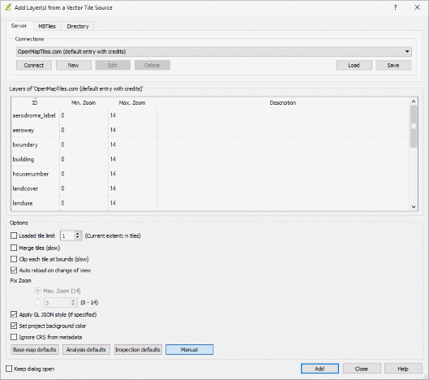
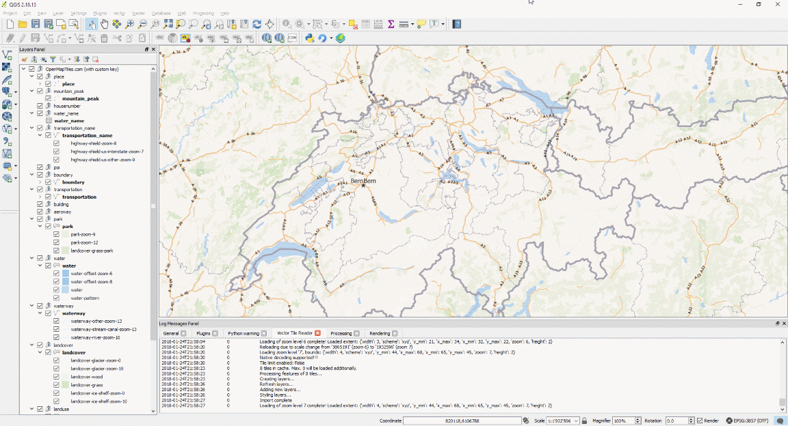
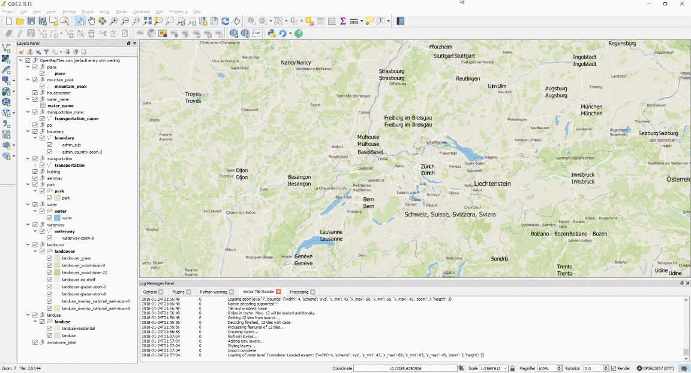

[](https://travis-ci.org/geometalab/Vector-Tiles-Reader-QGIS-Plugin)
[](https://coveralls.io/github/geometalab/Vector-Tiles-Reader-QGIS-Plugin?branch=HEAD)

# Vector Tiles Reader QGIS-Plugin

This Python plugin reads Mapbox Vector Tiles (MVT) from vector tile servers, local MBTiles files or from a directory in zxy structure.



## Help
A help can be found here: https://github.com/geometalab/Vector-Tiles-Reader-QGIS-Plugin/wiki/Help

## Styling
The plugin can create a QGIS styling from a Mapbox GL JSON style on the fly.






## License

The Vector Tile Reader plugin is released under the GNU license (see LICENSE)

## Contributors

Vector Tile Reader has been developed by

* Martin Boos

Acknowledgments:

* Stefan Keller
* Dijan Helbling
* Nicola Jordan
* Raphael Das Gupta
* Carmelo Schumacher

## Docker Tests

```
docker-compose build qgis2
docker-compose run -d --name qgis2 qgis2
docker exec -it qgis2 sh -c "qgis_testrunner.sh vector_tiles_reader"
```


## Technical documentation

Name conventions for Vector Tiles Reader QGIS Plugin:

* Official full name : "Vector Tiles Reader" or "Vector Tiles Reader QGIS-Plugin"
* Camel Case no space: "VectorTilesReader"
* Lower Case no space: "vector_tiles_reader"
* Abbreviated names  : "VT Reader" or "vtr"

## Requirements
* QGIS 3
* This Plugin was tested on Ubuntu 17.10, Windows 10 and OSX

## Installation
### QGIS Plugins
Download the latest published release inside QGIS:
1. _Plugins_ -> _Manage and Install Plugins..._
2. Search for 'Vector Tiles Reader'
3. Install

### Windows (QGIS 3)
```
:: Set the path on the next line to the directory where the plugin is located

set PATH_TO_VTR="C:\DEV\Vector-Tiles-Reader-QGIS-Plugin"
mklink /D "%appdata%\QGIS\QGIS3\profiles\default\python\plugins\vector_tiles_reader" %PATH_TO_VTR%

:: Make sure the IDE knows about the qgis package (run in admin console)
mklink /D "%programfiles%\QGIS 3.6\apps\Python37\Lib\site-packages\qgis" "%programfiles%\QGIS 3.6\apps\qgis\python\qgis"
```

### Ubuntu (QGIS 3)
```
ln -sr ./ ~/.local/share/QGIS/QGIS3/profiles/default/python/plugins/Vector-Tile-Reader
```

### OSX
Location of QGIS plugins directory:

QGIS|Path
---|---
2 | ~/.qgis2/python/plugins
3 | ~/Library/Application\ Support/QGIS/QGIS3/profiles/default/python/plugins

```
ls -s ./
```

## FAQ

#### How can I use the server connection feature?

Any vector tile service, implementing the [TileJSON specification](https://github.com/mapbox/tilejson-spec/tree/master/2.2.0)  should work.

For the feature to work, you have to create a connection using a URL pointing to the TileJSON of the tile service.

For example you can use `http://free.tilehosting.com/data/v3.json?key={API-KEY}` and get your own API-Key from [OpenMapTiles.com](https://openmaptiles.com/hosting/)
